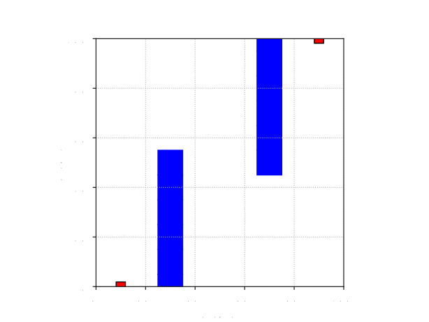

# Path Planning based on RL Algorithms
Implementing Reinforcement Learning (RL) Algorithms for global path planning in tasks of mobile robot navigation. Comparison analysis of Deep Q Network, Q-learning and Sarsa algorithms for the environment with obstacles.
## Description
RL Algorithms implemented in Python for the task of global path planning for mobile robot. Such system is said to have feedback. The agent acts on the environment, and the environment acts on the agent. At each step the agent:
* Executes action.
* Receives observation (new state).
* Receives reward.

The environment:
* Receives action.
* Emits observation (new state).
* Emits reward.

The following image shows the environment I estabilshed for this problem:
 

Red square: starting position and target position

Blue blocks: obstacles

